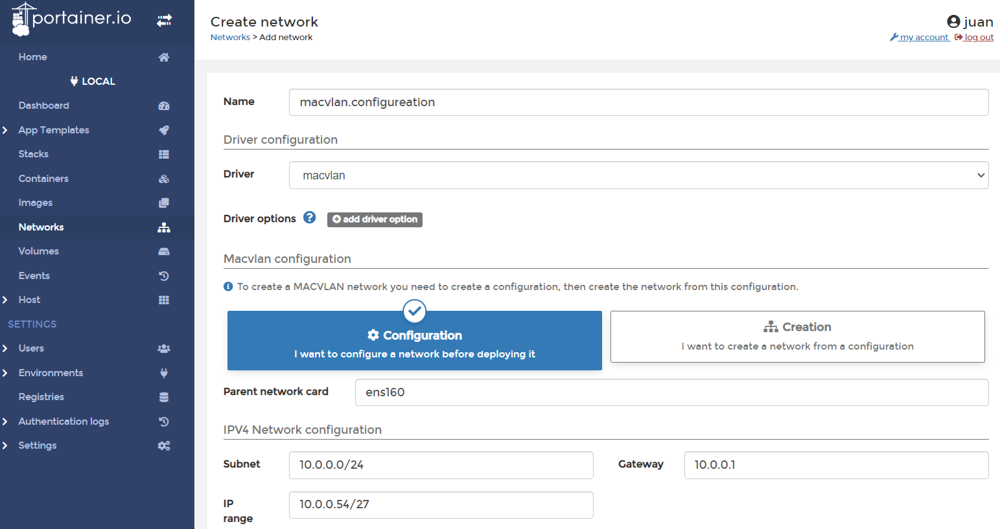
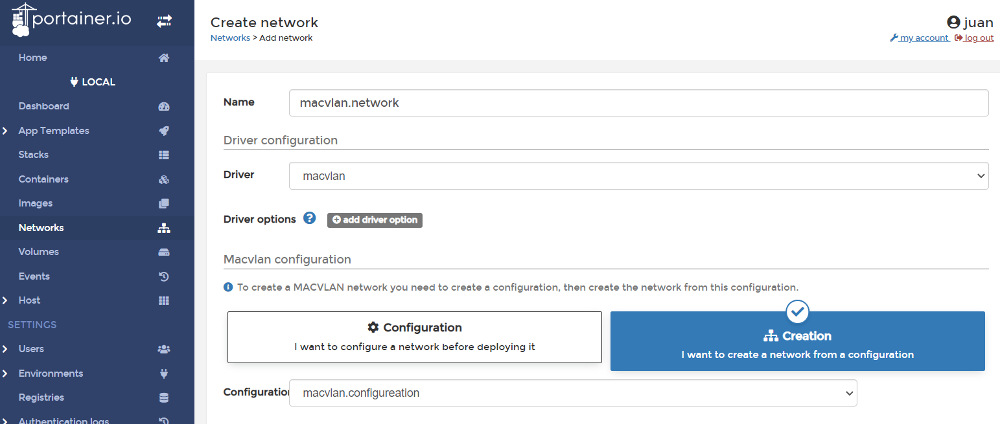

# MACVLAN Config/Network Creation





**Notes:**

## network:

```	
10.0.0.32/27
10.0.0.64/27
```

## usable range:

``` 
10.0.0.33 - 10.0.0.62
10.0.0.65 - 10.0.0.94
```

\#Default Volumes Path

``` 
/var/lib/docker/Volumes
```

## Default Portainer Bind folders

``` 
/portainer/Files/AppData/Config
```

